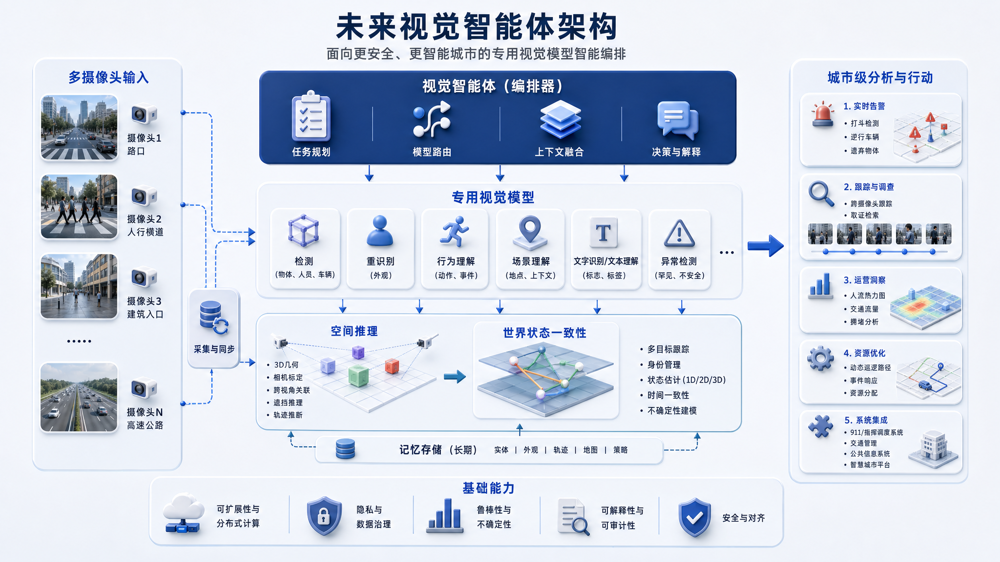

# dsh-video-retrieval

DeepSeek Harness 原生视频检索插件：把监控视频时空目标定位能力打包成标准 DSH 模式，一键安装即可在 DSH 网页里使用。

- **输入**：一段监控视频 + 一句自然语言描述（或一张人脸/人体参考图）
- **输出**：目标出现的**时间区间 + 逐帧 bbox 轨迹 + 标注视频**
- **硬件目标**：Apple Silicon（MPS）/ CUDA / CPU，本地推理为主、云端只做稀疏语义增强

---

## 系统远景与本插件定位

下面这张图是监控视频分析系统的**顶层愿景**——「未来视觉智能体架构」，面向更安全、更智能的城市：



图中描绘的是一个**城市级**闭环：多摄像头输入 → 采集与同步 → 视觉智能体（编排器）做任务规划/模型路由/上下文融合 → 专用视觉模型（检测、重识别、行为理解、场景理解、文字识别、异常检测）→ 空间推理 + 世界状态一致性（跟踪、身份、轨迹）→ 长期记忆存储 → 城市级分析与行动，底层由「基础能力」（可扩展、隐私治理、可解释、安全对齐）支撑。

**本插件正是这套系统的原型（prototype）**——它落地了图中核心的一条「垂直切片」，并留出了向上扩展的接口：

| 远景架构层 | 本插件（原型）的对应实现 | 状态 |
|---|---|---|
| 多摄像头输入 / 采集与同步 | 单路视频 + `preflight`（解码预检、IMKH/MPEG-PS 恢复、抽帧同步） | ✅ 单路；多路是演进方向 |
| 视觉智能体（编排器） | DSH 会话智能体 + 任务路由（`router`）+ 16 个 `vr_*` 工具 | ✅ |
| 专用视觉模型 | YOLO-World（检测）、OSNet/ArcFace/CLIP（重识别）、OCR（文字识别） | ✅ |
| 空间推理 / 世界状态一致性 | BoT-SORT 跟踪 + 逐帧 bbox 轨迹 + 时间区间 + 多信号投票 | ✅ 单场景一致性 |
| 长期记忆存储 | 案例库 + 演化配置（thresholds/confusables/prompts）+ 技能手册 | ✅ |
| 基础能力 | 自进化闭环、证据护栏（"insufficient 是判定而非漏检"）、视频不出本地 | ✅ |
| 城市级分析与行动 | 实时告警、跨摄像头协同、运营洞察 | ⏳ 未覆盖，架构已预留 |

换句话说：**图是"要建的城市级系统"，插件是"已经能跑的最小闭环"**——从"一段视频里按描述找人/车/牌"这个最硬的核心场景起步，验证了「视觉智能体编排 + 专用模型 + 多信号一致 + 自进化」这条主线。

---

## 目录

- [功能](#功能)
- [安装](#安装)
- [模型权重说明](#模型权重说明)
- [原理与架构](#原理与架构)
- [检索流程](#检索流程)
- [测试数据](#测试数据)
- [目录结构](#目录结构)
- [更新](#更新)
- [卸载](#卸载)
- [许可](#许可)

---

## 功能

- **自然语言 / 参考图检索**：文本描述或人脸/人体图 → 时间区间 + 逐帧框 + 标注视频
- **云边协同漏斗**：云端粗筛时间段 + 本地精查 + 多信号交叉验证
- **多信号甄别**：衣着色相 / 时间相似度曲线 / VLM 图对图终审，三票（默认 ≥2）才判命中
- **递归自进化**：案例确认 → Optuna 阈值优化 + 提示词/混淆表反射 → holdout 门禁 → 热加载
- **嵌入式三列控制台**：保留左侧会话列表，随时切回 DeepSeek 对话
- **16 个原生工具**：`vr_search` / `vr_preflight` / `vr_job_cancel` / `vr_evolve` 等

---

## 安装

### 方式一（推荐）：作为插件直接安装

```bash
# 1. 安装插件包（dsh.bundle 自动合入 profile，prepare 脚本自动构建 dist/）
dsh plugin --profile web add github:zhouql-dev/dsh-video-retrieval

# 2. 部署预设 + 下载权重（install.sh 从 profile 里定位已安装的包）
git clone https://github.com/zhouql-dev/dsh-video-retrieval.git /tmp/dsh-video-retrieval
bash /tmp/dsh-video-retrieval/scripts/install.sh

# 3. 重启 DSH（bundle 补丁是启动时事实）
npx @deepseek-ai/dsh web
```

### 方式二：从源码安装（开发）

```bash
git clone https://github.com/zhouql-dev/dsh-video-retrieval.git
cd dsh-video-retrieval
bash scripts/install.sh          # 构建 + 安装包 + 部署预设 + 下载权重
npx @deepseek-ai/dsh web
```

然后在新建会话界面选择 **视频检索模式**。

### 前置条件

- Node ≥ 22、pnpm
- Python ≥ 3.10 + venv（含 torch / ultralytics / opencv-python / rapidocr-onnxruntime / insightface / transformers / torchreid / scipy / optuna / fastapi / uvicorn / litellm）
- ffmpeg、tesseract（车牌 OCR）
- 可选 API key：`ZHIPUAI_API_KEY` / `DASHSCOPE_API_KEY`（无 key 时自动降级到本地全扫，不崩不谎报）

---

## 模型权重说明

插件需要以下模型权重。前三个由 `scripts/setup.sh` 从 GitHub Releases 下载到包内 `weights/`；insightface 模型由库自动下载到 `~/.insightface/`。

| 权重 | 引擎 | 用途 | 大小 | 必需 | 下载位置 |
|---|---|---|---|---|---|
| `yolov8s-worldv2.pt` | YOLO-World（开放词表检测） | **文本 → 目标框**：`set_classes([描述词])` 即可检测任意名词，本地 grounding 主力 | ~26 MB | ✅ | `weights/yolov8s-worldv2.pt` |
| `osnet_x0_25_msmt17_*.pth` | OSNet（行人重识别） | **参考图 → 认人**：512 维特征余弦相似度，person_search 主引擎 | ~9 MB | ✅ | `weights/osnet/` |
| `osnet_x1_0_msmt17_*.pth` | OSNet（行人重识别，高精度） | 同上的**高精度版**（x1.0），默认不用；设 `OSNET_WEIGHTS` 环境变量指向它即可启用 | ~17 MB | ➕ 可选 | `weights/osnet/` |
| `ViT-B-32.pt` | CLIP（图文模型） | ① YOLO-World 的**文本编码器**（`set_classes` 依赖）② 兜底图文匹配 | ~350 MB | ✅ | `weights/clip/` |
| `buffalo_l`（SCRFD `det_10g.onnx` + ArcFace `w600k_r50.onnx`） | insightface | **人脸识别**：SCRFD 检人脸 + ArcFace 512 维嵌入 | ~300 MB | ⚠️ 人脸检索时 | `~/.insightface/models/buffalo_l/`（首次使用自动下载） |

> **离线部署提示**：完全离线机器需预先把 `buffalo_l` 模型包放进 `~/.insightface/models/buffalo_l/`，否则人脸检索首次调用会尝试联网下载。

**降级链**（某引擎权重缺失时自动逐级退）：`insightface(ArcFace) → CLIP → VLM → 只出裁剪图给人工`，检索永不因缺模型而崩。

---

## 原理与架构

### 1. 云边漏斗（Cloud-Edge Funnel）

设计源自两条实测教训：**云端 VLM 会"自信地幻觉"**（图对图全答 yes、粉红混淆打 0.95 分）、**本地 embedding 会"草木皆兵"**（OSNet 阈值 0.55 下 16 个候选里 15 个误报）。结论：**谁都别单独信**——云负责粗筛（快、懂语义），本地负责精查（清、能读字），最后多信号交叉验证。

```
输入 ──► router(任务路由)
          ├── 精确文本(车牌/证件号) ──► 本地 OCR + 字符混淆表 ──► 全片扫描
          └── 语义(人物/物体描述) ───► 云粗筛时间段 ──► 本地检测+裁剪 ──► 三信号投票
```

**铁律**：本地基线永不硬依赖云端。所有云端调用 env-gated 静默降级，失败返 `None/[]`，本地照常运行——**"云端失败 ≠ 目标不存在"**。

### 2. 多信号甄别（§11.2 方法的产品化）

每个候选交给三个独立"证人"打分，**≥2 个（默认）作证才判命中**：

| 信号 | 算法 | 判据 |
|---|---|---|
| 颜色 | HSV 主色相直方图 + 圆形色相差 | 同一人 Δ色相 ≲35°；误报 60–110° |
| 时间曲线 | 相似度序列的"持续抬升占比" | 真人 0.35→0.83→0.35 平滑爬升；单帧尖峰是噪声 |
| VLM 终审 | 图对图"是否同一人" | exact / partial / no |

不能判断的信号**弃权**（灰色没法比颜色、无 key 无法终审），弃权不计入分母；**单一信号永不判命中**；剩余信号不足时给 `insufficient`，不假装结论。

### 3. 递归自进化（Evolution Loop）

```
案例确认 ──► 合并数据集(确认案例 + PRW + CCPD-GT) ──► Optuna 阈值优化
           ──► Layer1 混淆表/提示词反射 ──► holdout 门禁(新≥旧−0.005)
           ──► rollback 快照 ──► 热加载到 config/ ──► 下次检索生效
```

- **评估器极便宜**：信号 raw 值缓存后，优化只是"换阈值→重新投票→数对错"，微秒级。
- **质量分 = macro-F1**：数据极端不平衡（1 真 vs 54 噪声），accuracy 无效。
- `.veto` 冻结演化；`config/rollback/` 存快照；`evolutions.jsonl` 审计。

### 4. 作为 DSH 插件的结构

```
DeepSeek Harness 进程
├── 宿主半  src/index.js      → 16 个 vr_* 原生工具（defineTool，模式内可见）
├── 客户端半 dist-client/     → 三列控制台（shell.overlay）+ 侧边栏按钮
├── 预设     preset/          → 视频检索模式（standard + persona + 自带 skill + 工具）
└── cordis.patch.yml          → 全局 vr-console 行（便携路径，dsh.bundle 自动合入）
          │ HTTP :8788（submit/poll/result; SSE）
          ▼
   后端  server/server.py（FastAPI，vendor 自 fusion）—— 复用同一套检索逻辑
          │ spawn (SKILL_SCRIPTS=engine/)
          ▼
   引擎  engine/*.py（preflight / locate / verify_target / person_search / fast_plate_scan）
```

DSH **本身就是 agent 循环**：会话智能体读 skill 手册 → 计划 → 调 vr_* 工具 → 后端跑确定性剧本 → 三信号投票出结果。插件的 `agent/loop.py`（原 fusion 自带的 ReAct）不重复实现。

---

## 检索流程

### 端到端流水线

```
① preflight  解码预检（识别 IMKH/MPEG-PS 私有封装、冻结帧），必要时 ffmpeg 恢复
② router     车牌/证件号正则 → precise_text；否则 → semantic
③ 分支
   ├─ precise_text：本地 OCR + 字符混淆表（Q↔9/1、G↔6、8↔B…），全片双遍扫描
   └─ semantic：云粗筛时间段(可关) → 窗口内本地检测 + 裁剪 → 三信号投票
④ 输出       intervals.json(时间区间) + matches/boxes.json(逐帧框) + 标注帧 + report.html
```

### 使用流程（DSH 内）

1. 新建会话 → 选 **视频检索模式** → 三列控制台自动打开（也可点侧边栏「视频检索」）
2. 在控制台：选视频（本地解码不出机）→ 输入描述或上传参考图 → 检索
3. 右侧看命中片段（标注帧 + 播放），或直接对话让 agent 用 `vr_*` 工具检索
4. 结果可「确认/否认」，确认即喂给演化层

---

## 测试数据

### 真机系统实测（Apple M4 / 16GB / MPS）

| 查询 | 覆盖率 | 处理 FPS | 峰值内存 | 时间区间数 |
|---|---|---|---|---|
| `person riding a bicycle` | 93% | 25.0 | 1.52 GB | 5 |
| `white car` | 100% | 26.8 | 1.78 GB | 1 |
| `pedestrian … light beige coat`（+VLM） | 94% | 20.1 | 1.79 GB | 2 |

25–27 FPS 高于片源 22 FPS = 真正实时；内存 ~1.5–1.8 GB（≈16GB 的 10%）。

### 开放数据集基准（带 GT，SOTA 对照）

| 数据集 / 任务 | 指标 | 结果 | 口径说明 |
|---|---|---|---|
| Ref-DAVIS17（视频目标定位） | box_tube_iou / temporal_iou | **0.550 / 0.841**（稀疏 pivot Δ=5）@ 88 FPS | 逐帧 dense YOLO-World 为 0.535/0.684；GroundingDINO-Tiny 0.762/0.992 但仅 0.72 FPS（非实时） |
| PRW（参考图→行人检索） | mAP / CMC-1 | **0.427 / 0.998**（OSNet x1.0，余弦协议） | oracle detections 隔离匹配质量；x0.25 为 0.378/0.998 |
| CCPD（车牌检测） | 检测率 / IoU50 | **0.863 / 0.648** | balance 子集文件名已匿名化，识别准确率不可测（仅检测） |
| CCPD-GT（车牌识别，98,459 张） | 读取率 | tesseract 0.30 → **PP-OCRv4 0.98** | 6 位字母数字（无省字符）口径 |
| RSTPReid（文本→行人检索） | R@1（零样本 CLIP） | **0.074** | 训练版 SOTA 0.62，诚实差距 |
| IJB-A（人脸 1:1 验证） | TAR@FAR=0.001 | **0.9555** | 官方 10-split；2019 SOTA 0.92 |

### 端到端验收线（完整云边）

| 验收 | 结果 |
|---|---|
| 人物检索（参考图 80×280 女性，粉外套白裤） | GT 覆盖 **2/2**，误报区间 **18**（基线 91，场景自适应后） |
| 车牌检索「京Q1G728」 | 云 grounding 返空 → 自动全片本地 OCR → 锁定 **838–840s**（5 命中） |
| 自进化（Optuna 阈值） | macro-F1 **0.4549 → 0.4818**；holdout 门禁采纳 |
| 自进化（混淆表反射） | 车牌混淆表 **0.8241 → 1.0**（57 行真实数据） |

### 插件端到端冒烟（DSH 会话实测）

- `vr_preflight` 实测 mp4 → `verdict: OK`（修复了 lossless-JSON 输出边界 bug）
- `vr_search` "car" → `verdict: hit`，区间 `[2.88s, 5.88s]`，逐帧车牌 OCR 收敛到 **粤Q·1G728**

---

## 目录结构

```
dsh-video-retrieval/
├── package.json              # dsh.bundle + dsh.client + prepare 构建脚本
├── cordis.patch.yml          # bundle 补丁（全局客户端控制台行，便携路径）
├── preset/video-retrieval/   # 模式组合 + 自带 skill
│   ├── agent.cordis.yml      # 模板；install.sh 把 __...__ 占位符替换为绝对路径
│   ├── preset.yml
│   └── skills/video-retrieval/SKILL.md
├── src/index.js              # 宿主半（16 个 vr_* 工具）
├── dist-client/index.js      # 客户端 bundle（__ModuleLoader__ 格式）
├── engine/                   # 引擎脚本（vendored）
├── server/                   # fusion 镜像（vendored）+ web GUI
├── scripts/
│   ├── install.sh            # 部署预设 + 下载权重 + 冒烟
│   ├── setup.sh              # 下载权重
│   ├── sync.sh               # 【开发者专用】从私有 fusion/skill 源同步 engine/server
│   ├── serve.sh              # 控制台标签页启动
│   ├── smoke.mjs             # 纯 Node 冒烟（CI 用）
│   └── cdp.mjs               # Chrome DevTools 调试辅助
├── build.mjs                 # 宿主半构建（dist/index.js）
├── .github/workflows/        # ci.yml + release.yml
├── weights/                  # .gitignore；由 setup.sh 下载
├── config/                   # 运行时演化配置
└── data/                     # 运行时案例/任务/上传
```

---

## 更新

```bash
# 普通用户：重新安装最新版即可
dsh plugin --profile web add github:zhouql-dev/dsh-video-retrieval
bash scripts/install.sh        # 若预设/脚本有更新
# 浏览器刷新页面即可（客户端 bundle 内容变更无需重启 dsh）
```

## 开发者：同步 vendored 源码

`engine/` 和 `server/` 是本插件 vendored 的引擎脚本与 fusion 后端镜像，**它们的权威源不在本仓库**（在开发者的私有 `fusion/` 检出和 skill 源里）。插件开发者用 `sync.sh` 单向同步：

```bash
VTL_REPO_DIR=/path/to/your/video-retrieval        # 含 fusion/ 的私有仓库根
VTL_SKILL_DIR=/path/to/skills/video-target-localize
bash scripts/sync.sh
```

未设置这两个环境变量时，`sync.sh` 会安全跳过对应部分。

---

## 卸载

```bash
rm -rf ~/.dsh/.agent-presets/video-retrieval
dsh plugin --profile web remove dsh-video-retrieval
# 重启 dsh web
```

## 许可

MIT
